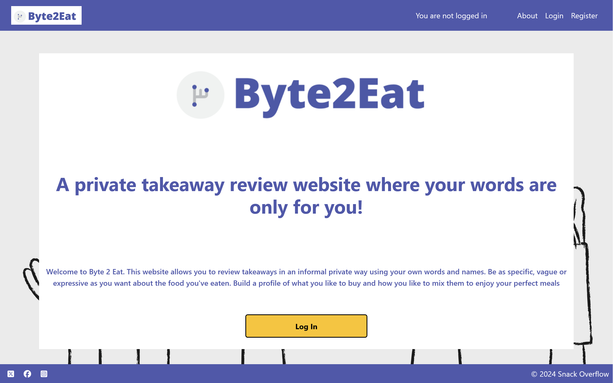
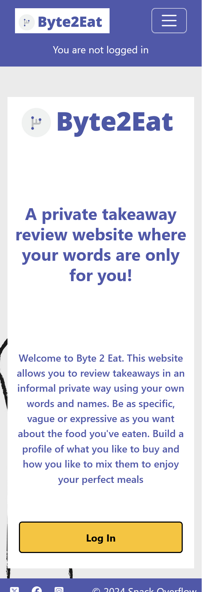
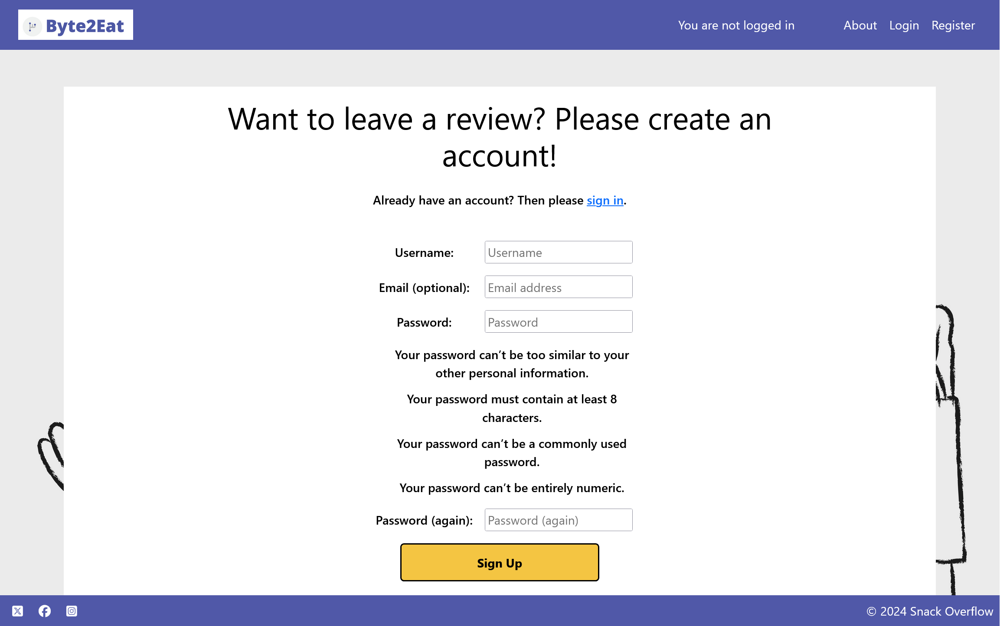
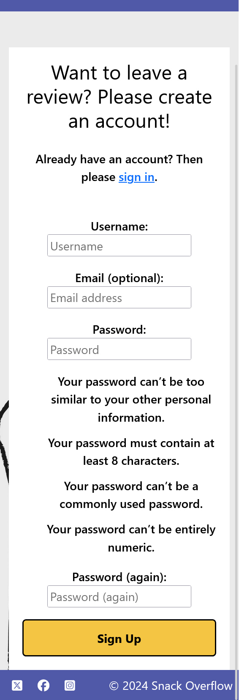
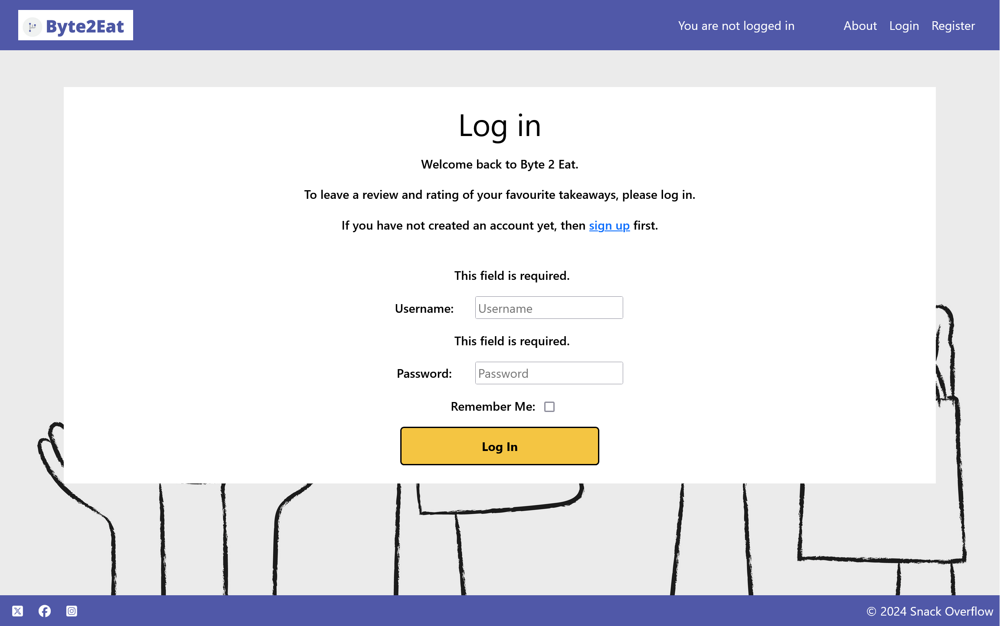
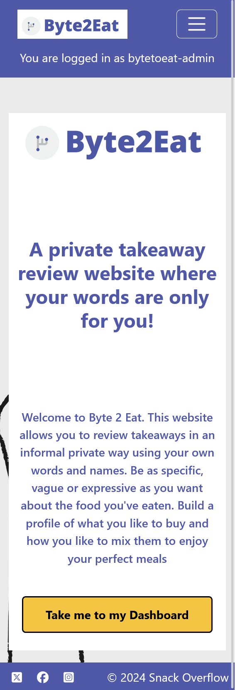
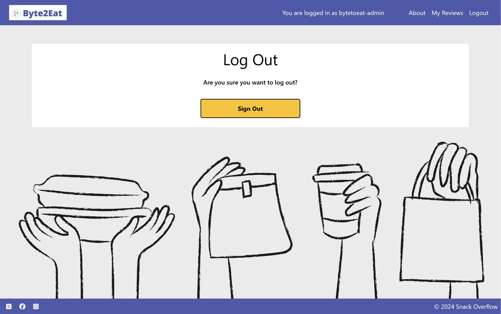
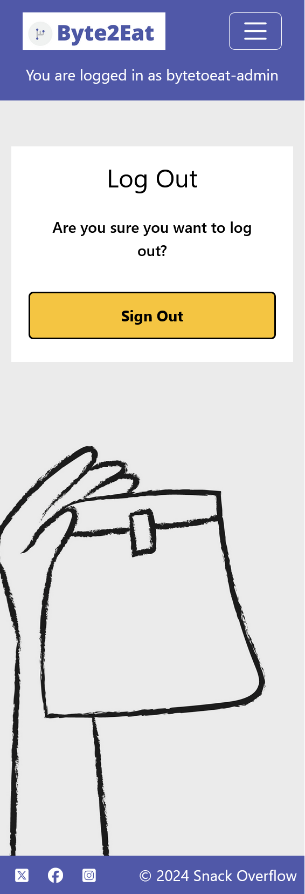

 # Byte 2 Eat

## Contents
1. [Introduction](#introduction)
2. [The Team](#the-team)
3. [Planning](#planning)
4. [Design](#design)
5. [Repository, Project Board and Deployment](#project-base)
6. [Wireframes](#Wireframes)
7. [Features](#Features)
8. [Deployment](#Deployment)
9. [Technology](#Technology)
10. [Future Features](#Future-Features)
11. [Testing](#Testing)
12. [Validator Testing](#Validator-Testing)
13. [Credits](#Credits)
14. [Content Credit](#Content-Credit)
15. [Further Thoughts](#Further-Thoughts)

# Introduction

Welcome to Byte 2 Eat, a website designed to allow private users to review takeaways without having to make any public declaration. This offers a chance for highly personal reviews to be left of any standard without concerns for how it may look, legal consequences or controversy.

This website was created during Hackathon 3 of the "16-Week High-Performance Full Stack Skills Bootcamp" which ranged from 15/08/2024 (from 9am) to 19/08/2024 (up to 1.30pm) covering a weekend period. There were no planning or preparation conducted before the start day.

The goal of this Hackathon was to demonstrate the construction of a full-stack web development project using HTML, CSS, JavaScript, Python and Django in a team environment. 

## The Team

Together, we are Snack Overflow!

In alphabetical (by surname) order, here are the members of the team:-

The full-time developers: 

* Christina Hughes - (https://github.com/CHughes13)
* Barrie Millar - (https://github.com/CyberArchitect777)
* Samuel Parker - (https://github.com/SamuelParkerTech)

Additional development only (due to other course / personal commitments):

* Leander Otis - (https://github.com/LO-CI24)
* Jamie Pudsey - (https://github.com/JPudsey-11)
* Aeryx Rose - (https://github.com/SubjugatorofCSS)

## Planning Methodology 

Using Agile ideals, the project was designed with the principle of minimum viable product in mind. Therefore, it was decided that a very simple product would be constructed before any additional features were added. It was determined early on that the following features would be applicable to our project. 

Must-do:

- A login and registration system for our users to sign in to their private review areas
- A review screen where comments could be added, edited or deleted.
- Additional pages for form additions to achieve this as needed.
- A site that was effortless to use in order to allow users to quickly check in and out to submit their own ideas.

Should-do: 

- A wishlist of takeaways that people might like to try.

Won't do: 

- A public facing area showing all reviewed takeaways as this is not applicable to our project idea.
- Email / reset password login as the development of this feature requires an email server and is beyond the scope of this project.

A [Google document](https://docs.google.com/document/d/1tP5J2UAh9JbXni9sQfab1tEwxLOkr21A9vTms7MyAY4). A [Miro Board](https://miro.com/app/board/uXjVKpKknpw=/) was also established for the same reason. A screenshot of this board can be seen below. 

## Repository, Project Board and Deployment

Our project details can be found in the following places. 

Project Board - (https://github.com/users/CyberArchitect777/projects/11)

GitHub Repository - (https://github.com/CyberArchitect777/hackathon3-byte-to-eat-project)

Heroku Live Deployment - (https://hackathon3-byte-to-eat-project-25fab4e92590.herokuapp.com)

## Design

### Colour scheme

Site: Purple: (#5058A8) \ White (#FFFFFF)

Logo: Purple (#5058A8) \ Fork grey (#BCBEC0) \ Circle grey (#F0F2F1)

UI is Minimalist and simple with a tech-y edge to ensure an easy-to-use site.

### Wireframes

To design the project, we used Balsalmiq to create a number of wireframes. Our design concepts are shown below:-

Main Page \

Register / Login \

Register Food / Review \

## Features

The main features of the site are a login management system, a user dashboard to view, create, edit and delete takeaway reviews and an about page. The screenshots below show the site as seen on desktop and mobile.

Once entering the website, the user is greeted with the following page on desktop and on mobile. Note the different ways that the logged in status is shown on desktop and mobile to provide clarity to users on both platforms.

 

From here, you can register for the site as shown below.

If you are already signed up, you can log in from this page instead.

 
 

Once logged in via the register page or log in page, the following index page is shown.

 

When the user wants to sign out, they can do it here.

 

## Deployment Via Heroku

Byte 2 Eat was deployed to Heroku as a project early on in the development. The following information is what was used to achieve this. 

Setting up a fresh project

- pip3 install django
- django-admin startproject bytetoeat .
- python3 manage.py startapp index
- python3 manage.py runserver
- Make sure the local environment is added to ALLOWED_HOST in settings.py
- Check the project works

Setting up the index page

- Add to the urls.py codebase in the project directory before doing the same with views.py
- A basic message should be displayed on your local environment.

Deploy to Heroku

- Create a new project on Heroku. After that, go to the settings tab and reveal config vars. Add a key of DISABLE_COLLECTSTATIC and a value of 1 before clicking Add.

In GitPod

- pip3 install gunicorn
- pip3 freeze --local > requirements.txt
- echo "web: gunicorn bytetoeat.wsgi" > Procfile
- Set DEBUG to False in settings.py and also add ’.herokuapp.com’ to ALLOWED_HOSTS
- Commit and push to GitHub

In Heroku
- Go to the Deploy tab for this created project.
- In the deployment method, select GitHub
- Find the bytetoeat repository and select it.
- Deploy branch to start a manual deployment of the main branch.
- Click on open app to view the deployed project.
- Open resources and choose an eco dyno, a lightweight container.
- Verify that there is no existing Postgres database add-on. If there is one, you can destroy it, otherwise the costs can be significant.

Local environment

- Set DEBUG to True
- env.py: Fill out the file to set an environment variable called DATABASE_URL to the database that is being used. 
- Add env.py to .gitignore
- pip3 install dj-database-url psycopg2
- pip3 freeze --local > requirements.txt
- Import the following code into bytetoeat/settings.py: 

import os
import dj_database_url
if os.path.isfile('env.py'):
	import env

- Set up the database link in settings.py to read from env.py locally or from the DATABASE_URL environment variable on Heroku
- Run python3 manage.py migrate
- python3 manage.py createsuperuser # Choose a username, email and password for super user access to Django
- Git commit and push again and re-deploy the project on Heroku

Heroku

- Finally make sure again that there are no database addons on Heroku and that the DATABASE_URL has been set correctly.

Final steps

- DEBUG should be off on deployment, or a method found to automatically switch it off as it has been done in this project.
- No secret information nominally found in env.py or environment variables should be exposed onto public respositories or websites.

## Technology

* Github - Version Control & Project Kanban / Issues
* Gitpod - Code Editor
* Django - Python Framework
* Bootstrap - CSS Framework
* [Google Fonts](https://fonts.google.com) - Open Sans Font 
* [Miro](https://miro.com/) - Project Ideas Board & ERD Creation 
* [Coolors.co](https://coolors.co/) - Colour palette/tone helper 
* [Balsamiq](https://balsamiq.com/) used to create wireframes
* Google Docs - Sharing and hosting files
* AllAuth
* Am I Responsive https://ui.dev/amiresponsive?url=https%3A%2F%2Fbytes.de

### Django Requirements

* asgiref==3.8.1
* cloudinary==1.40.0
* dj-database-url==0.5.0
* dj3-cloudinary-storage==0.0.6
* Django==4.2.14
* django-allauth==0.57.2
* django-summernote==0.8.20.0
* gunicorn==20.1.0
* oauthlib==3.2.2
* psycopg==3.2.1
* PyJWT==2.9.0
* python3-openid==3.2.0
* requests-oauthlib==2.0.0
* sqlparse==0.5.1
* urllib3==1.26.19
* whitenoise==5.3.0

## Future Features

## Testing

Testing was done both manually and using Validators (see next section).

## Validator Testing

## HTML
Tested the HTML using W3 Validator using the URL checker function. https://validator.w3.org/
No issues - 

## CSS
CSS Validator testing used the jigsaw validator: https://jigsaw.w3.org/css-validator/ and posted no issues. 

## Javascript
Javascript was testing using JS Hint: https://jshint.com/

## Python PEP 8 CI Checker - https://pep8ci.herokuapp.com/

### User Profile Pages - checked and clear

### Index - checked and clear

### About - checked and clear

## Credits
### Resources Used and Consulted
- [Stack Overflow](https://stackoverflow.com/) for troubleshooting and understanding coding concepts.
- [MDN web docs](https://developer.mozilla.org/) for helpful guides on all things coding.
- [W3Schools](https://www.w3schools.com/) for helpful guides on all things coding.
- [Django Project](https://docs.djangoproject.com/) for helpful guides on all things Django.
- [Bootstrap](https://getbootstrap.com/) for docs about Bootstrap.
- [ChatGPT](https://openai.com/chatgpt/) used throughout for coding advice and inspiration.
- [Blackbox AI](https://www.blackbox.ai/) used throughout for coding advice and inspiration.
- [Font Awesome](https://fontawesome.com/) for the social media icons in footer.
- Background image - [Food delivery doodle vector with eco-friendly packagings by rawpixel.com via Freepik](https://www.freepik.com/free-vector/food-delivery-doodle-vector-with-eco-friendly-packagings_18880323.htm)

### Special Thanks to
- [Spencer Barriball](https://github.com/5pence/demodemo/blob/main/assets/js/script.js)
- Code Institute's Subject Matter Expert Kevin
- Code Institute's Coding Coach Martin
- Code Institute's Coding Coach Mark
- Code Institute's Coding Bootcamp Tutor Lewis
- Code Institute's Cohort Facilitator David
- Everyone in the April 2024 WW Bootcamp
- All of our family and friends for putting up with the late nights, testing requests and making LOTS of cups of tea.

## Further Thoughts

### 
### 
