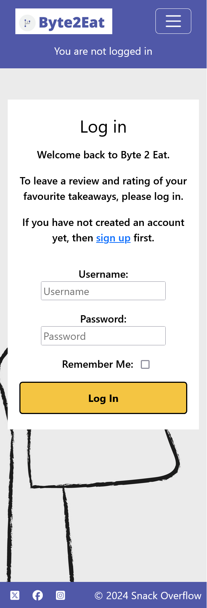

 # Byte 2 Eat

## Contents
1. [Introduction](#introduction)
2. [The Team](#the-team)
3. [Planning](#planning)
4. [Design](#design)
5. [Repository, Project Board and Deployment](#project-base)
6. [Wireframes](#Wireframes)
7. [Features](#Features)
8. [Deployment](#Deployment)
9. [Technology](#Technology)
10. [Future Features](#Future-Features)
11. [Testing](#Testing)
12. [Validator Testing](#Validator-Testing)
13. [Credits](#Credits)
14. [Content Credit](#Content-Credit)
15. [Further Thoughts](#Further-Thoughts)

# Introduction

Welcome to Byte 2 Eat, a website designed to allow private users to review takeaways without having to make any public declaration. This offers a chance for highly personal reviews to be left of any standard without concerns for how it may look, legal consequences or controversy.

This website was created during Hackathon 3 of the "16-Week High-Performance Full Stack Skills Bootcamp" which ranged from 15/08/2024 (from 9am) to 19/08/2024 (up to 1.30pm) covering a weekend period. There were no planning or preparation conducted before the start day.

The goal of this Hackathon was to demonstrate the construction of a full-stack web development project using HTML, CSS, JavaScript, Python and Django in a team environment. 

## The Team

Together, we are Snack Overflow!

In alphabetical (by surname) order, here are the members of the team:-

The full-time developers: 

* Christina Hughes - (https://github.com/CHughes13)
* Barrie Millar - (https://github.com/CyberArchitect777)
* Samuel Parker - (https://github.com/SamuelParkerTech)

Additional development only (due to other course / personal committments):

* Leander Otis - (https://github.com/LO-CI24)
* Jamie Pudsey - (https://github.com/JPudsey-11)
* Aeryx Rose - (https://github.com/SubjugatorofCSS)

## Planning Methodology 

Using Agile ideals, the project was designed with the principle of minimum viable product in mind. Therefore, it was decided that a very simple product would be constructed before any additional features were added. It was determined early on that the following features would be applicable to our project. 

Must-do:

- A login and registration system for our users to sign in to their private review areas
- A review screen where comments could be added, edited or deleted.
- Additional pages for form additions to achieve this as needed.
- A site that was effortless to use in order to allow users to quickly check in and out to submit their own ideas.

Should-do: 

- A wishlist of takeaways that people might like to try.

Won't do: 

- A public facing area showing all reviewed takeaways as this is not applicable to our project idea.
- Email / reset password login as the development of this feature requires an email server and is beyond the scope of this project.

A Google document was set up to share and discuss ideas (https://docs.google.com/document/d/1tP5J2UAh9JbXni9sQfab1tEwxLOkr21A9vTms7MyAY4). A Miro Board (https://miro.com/app/board/uXjVKpKknpw=/) was also established for the same reason. A screenshot of this board can be seen below. 

## Repository, Project Board and Deployment

Our project details can be found in the following places. 

Project Board - (https://github.com/users/CyberArchitect777/projects/11)

GitHub Repository - (https://github.com/CyberArchitect777/hackathon3-byte-to-eat-project)

Heroku Live Deployment - (https://hackathon3-byte-to-eat-project-25fab4e92590.herokuapp.com)

## Design

### Colour scheme

Site: Purple: (#5058A8) \ White (#FFFFFF)

Logo: Purple (#5058A8) \ Fork grey (#BCBEC0) \ Circle grey (#F0F2F1)

### Wireframes

To design the project, we used Balsalmiq to create a number of wireframes. Our design concepts are shown below:-

Main Page \

Register / Login \

Register Food / Review \

## Features

The main features of the site are a login management system, a user dashboard to view, create, edit and delete takeaway reviews and an about page. The screenshots below show the site as seen on desktop and mobile.

Once entering the website, the user is greeted with the following page on desktop and on mobile. Note the different ways that the logged in status is shown on desktop and mobile to provide clarity to users on both platforms.

 

From here, you can register for the site as shown below.

If you are already signed up, you can log in from this page instead.

 
 

Once logged in via the register page or log in page, the following index page is shown.

 

When the user wants to sign out, they can do it here.

 

## Deployment Via Heroku

First make sure the Debug is set to false \
In our project Debug was set via env.py so was active locally but disabled on Heroku automatically. \

Connect your Github to your Heroku \

Make sure VARS are set correctly. \

In the deploy tab, scroll down and deploy MAIN Branch \

## Technology

* Github - Version Control & Project Kanban / Issues
* Gitpod - Code Editor
* Django - Python Framework
* BootStrap - CSS Framework
* Google Fonts - Open Sans Font https://fonts.google.com
* Miro - Project Ideas Board & ERD Creation https://miro.com/
* Coolors.co - Colour pallette/tone helper https://coolors.co/
* Google Docs - Sharing and hosting files
* AllAuth
* Am I Responsive https://ui.dev/amiresponsive?url=https%3A%2F%2Fbytes.de

### Django Requirements

* asgiref==3.8.1
* cloudinary==1.40.0
* dj-database-url==0.5.0
* dj3-cloudinary-storage==0.0.6
* Django==4.2.14
* django-allauth==0.57.2
* django-summernote==0.8.20.0
* gunicorn==20.1.0
* oauthlib==3.2.2
* psycopg==3.2.1
* PyJWT==2.9.0
* python3-openid==3.2.0
* requests-oauthlib==2.0.0
* sqlparse==0.5.1
* urllib3==1.26.19
* whitenoise==5.3.0

## Future Features

## Testing

Testing was done both manually and using Validators (see next section).

## Validator Testing

## HTML
Tested the HTML using W3 Validator using the URL checker function. https://validator.w3.org/
No issues - 

## CSS
CSS Validator testing used the jigsaw validator: https://jigsaw.w3.org/css-validator/ and posted no issues. 

## Javascript
Javascript was testing using JS Hint: https://jshint.com/

## Python PEP 8 CI Checker - https://pep8ci.herokuapp.com/

### User Profile Pages
urls.py \

views.py \

## Credits

## Content Credit
Images from Unsplash.com & Freepik.com

## Further Thoughts

### 
### 
